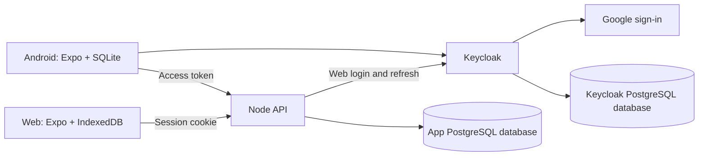

# BUPA-Satsang Kitchen architecture

Date: 2026-09-06. Status: agreed design with implementation paused; detailed planning requested. Product decisions come from the [kitchen specification](../../planning/2026-09-05-kitchen-proposal.md) and [screen journeys](../../planning/2026-09-06-kitchen-screens.md). Keycloak is the working authentication choice following the user's instruction to proceed with the presented option. A partial application scaffold exists; implementation and native compilation are paused at user request. No production infrastructure has been created.

## 1. Product boundaries

Build one BUPA-Satsang platform with shared identity, community membership and events. Kitchen is its first module. An event may span one or multiple days and contains multiple dated meals. Each meal has its own menu/headcount request, ingredient requirements and dish leftovers; shopping assignments, itemwise bills and other expenses remain under the parent event. Multi-day, multi-meal events are part of launch scope. The five operational roles are Ravisabha head, kitchen head, shopper, chef and cashier. Community administration is an additional permission.

The first release serves at most 200 registered volunteers on Android and responsive web. English is the default, with a persistent Gujarati switch. Purchases, bills, other expenses and leftovers work offline after an authenticated event download. Google handles volunteer sign-in and account recovery through Keycloak.

Expenses remain editable after the meal, with attributed history. There is no financial approval or finalise/reopen workflow. Reports show the latest accepted expenses by category, item, bill and shopping volunteer, respecting access. Leftovers use quantity plus a dish-appropriate unit; zero is distinct from unrecorded.

Excluded: file uploads, receipts, inventory, income/funds, advances, carry-over, reimbursements, payment methods or execution, dish-cost allocation, automatic recipe estimation, WhatsApp integration and future event modules. Initial historical import is a local maintainer operation, not an app upload screen. Notifications and dedicated goods-handover acknowledgement are deferred; recorded purchases do not prove delivery.

Proposed launch defaults to review together: administrators create events and assign roles; kitchen head/cashier can read and correct all other expenses; Ravisabha head can read those expenses; meal scheduling, menu and requirement changes need internet. Completing one meal does not complete other meals or close the event; its menu/leftovers remain distinguishable in history and expenses stay editable. Event deletion is unavailable in the volunteer UI.

## Event and meal structure

Confirmed hierarchy: Community → Event → dated meals → menu entries, requirements and leftovers. Meals are Kitchen records under the shared event; other future modules need not define meals. A newly created event can have an empty draft meal schedule. Days are presentation groups derived from meal dates; they do not need separate permission boundaries or a mandatory Day table. A one-meal Ravisabha is the simplest instance of this same model.

An event has an inclusive start/end date and an IANA timezone (proposed default Asia/Kolkata). Each meal has a stable ID, local service date, meal label/type, optional serving time, planned devotee count (nullable until supplied) and lifecycle independent of the other meals. Proposed meal states are planned, completed and cancelled. Suggested labels include morning snacks, lunch, afternoon snacks and dinner; allow custom labels and more than one meal of the same type on a date. A date/type combination is not the meal's identity. Purchasing dates may precede the event; meal service dates must fall within its date range.

Menu entries belong to a specific meal, even when the same dish catalog item appears in several meals. Quantities and headcounts are not copied implicitly from an event-wide value. Summing per-meal headcounts counts meal attendances, not unique devotees. Leftovers attach to the stable meal-menu-entry ID, so lunch rotlis and dinner rotlis cannot overwrite or conflict with each other.

Meal-specific requirements can be consolidated by ingredient and compatible unit across selected meals, a day or the event. Retain the individual requirement IDs behind a combined shopping row. Common event supplies may use requirements with no meal association. A bulk bill line may reference several requirements without being duplicated. Such references alone do not split a purchased quantity or monetary amount across meals. If 8 kg is bought against combined requirements of 5 kg for lunch and 5 kg for dinner, show 8/10 kg for the combined group; do not claim both meals are fulfilled or invent a per-meal split.

Existing event roles apply across the event's meals. Meal selection filters workflow context, not authorization. Editing dates/times must preserve meal and menu-entry IDs; date-range changes cannot silently discard meals outside the revised range. Retire/cancel referenced meals or menu entries with history instead of hard deletion, and retain offline operations for resolution. Completed/cancelled meal context must not erase valid purchases or prohibit late event expense sync.

Home still selects the current/upcoming assigned event. Inside Kitchen, group meals by date, highlight the current/next meal and retain a clear day/meal selector for menu, headcount, requirements and leftovers. Event expenses remain accessible independently of which meal is selected. Explicit selection must not change an open form's meal target when the clock crosses midnight.

Confirmed cost model: report both event and per-meal expenses. A bill line or other expense can allocate monetary amounts to one or more meals in the same event; any unallocated remainder is Common event cost. Empty allocations mean the full amount is common. Requirement links describe intended use and do not implicitly allocate money or purchased quantity. Dish-cost allocation remains excluded.

Store meal allocations against individual bill lines and other-expense records, never as another copy of a bill or as an extra expense. Each source has at most one allocation per meal, using exact positive amounts; their sum cannot exceed that source's amount. Common event cost is derived as source amount minus allocations, not a second editable allocation record. Example: an INR 1,000 rice line allocated INR 400 to Day 1 lunch and INR 350 to Day 2 lunch leaves INR 250 common; it contributes INR 1,000 once to the event total.

The authoritative reconciliation is event total = sum of allocated meal totals + common event costs, over the same active records. A meal's displayed total is its attributed cost; it is not an estimate of a fully apportioned meal cost while common costs remain. Other expenses is a different dimension: vessel cleaning is an other-expense record that may itself be allocated to meals or remain common. Common cost can also contain grocery bill amounts.

All five roles can read event/meal totals and the common-cost aggregate. Allocation details follow the underlying bill/expense visibility; editing allocations follows the underlying correction permission and remains available after meals finish. Allocation edits are part of the same versioned, offline-capable mutation as their source record. Reducing a source amount below its allocations requires explicit correction; do not silently rescale amounts or overwrite a competing allocation edit.

Meal filters in category/item/bill/shopper reports use only the amounts allocated to that meal; common costs get a separate event-level view and are not repeated in every meal. For restricted users, detailed reports include only readable source records and identify their subtotal. Source amounts must not multiply when joined to several allocation rows. Cancelling or rescheduling a meal retains existing cost attribution through its stable ID and never erases recorded expense.

## 2. Architecture choices and alternatives

| Area | Proposed choice | Reason and trade-off |
| --- | --- | --- |
| Client | One Expo Router application for Android and web | Shared forms and workflow logic suit the agreed screens. Desktop layouts can use platform-specific components. |
| Workspace | pnpm workspaces with light Nx orchestration | Shared contracts and explicit task dependencies without forcing every package through an Nx generator. |
| UI | React Native primitives, a small shared component layer, React Hook Form and Zod | Accessible forms and a consistent design. Standard shadcn/ui is not a native component library; leave it out of the universal baseline. |
| Remote reads | TanStack Query | Handles request state and revalidation. Offline editable records come from the durable local store, not an independent Query copy. |
| UI state | Small Zustand store only if needed | Filters and ephemeral selection; no bills or identity tokens in persisted Zustand. |
| Android storage | expo-sqlite | Transactional records and outbox survive restart. Credentials use SecureStore separately. |
| Browser storage | IndexedDB through Dexie | Transactional local records and outbox without relying on Expo SQLite's alpha web support. |
| API | Node.js/TypeScript, NestJS with its standard HTTP adapter | One modular transactional service. Avoid separate kitchen services, Redis and message brokers at launch. |
| Server data | PostgreSQL with Drizzle migrations | Relational constraints, explicit transactions and exact amounts. Application and Keycloak use separate databases/users. |
| Identity | Keycloak with Google as identity provider | Self-hosted identity; the team owns its upgrades, configuration and recovery. Kitchen access remains in the app database. |
| Deployment | Docker Compose and Caddy on the proposed Netcup VPS | Small, understandable single-host deployment, with CI builds and off-host backups. |

Two alternatives were considered. Separate Expo Android and React web applications provide more freedom for dense desktop editing, at the cost of two UI implementations. A web-first PWA delays the requested Android application. The selected workflow does not currently justify either trade-off; prove the universal bill-entry form early and revisit only if concrete usability evidence warrants it.

Version policy: use maintained stable releases, pin the resolved versions and commit the lockfile. Do not combine independently newest Expo, React and React Native versions. Use the compatible versions selected by the Expo SDK. Nx's current plugin matrix lists Expo 53–55, while the latest Expo documentation is already ahead; use explicit Nx run-command targets for Expo CLI tasks unless a current compatible plugin is demonstrated. Resolve and record the actual version matrix during foundation work, then run Expo dependency checks and both platform builds. [Expo monorepos](https://docs.expo.dev/guides/monorepos/), [Nx Expo requirements](https://nx.dev/docs/technologies/react/expo/introduction)

Expo documents persistent SQLite databases on native platforms and alpha web support requiring additional browser headers. Dexie provides IndexedDB transactions for browser storage. Using different adapters behind one contract is the proposed reliability trade-off. [Expo SQLite](https://docs.expo.dev/versions/latest/sdk/sqlite/), [Dexie design](https://dexie.org/docs/Tutorial/Design)

## 3. System structure



```text
apps/client/                 Expo routes, screens and platform composition
apps/api/                    Nest modules and web authentication endpoints
packages/contracts/          Runtime schemas and versioned DTOs
packages/domain/             Exact money, units and pure permission decisions
packages/local-store/        SQLite/native and Dexie/web persistence adapters
packages/sync/               Outbox orchestration and snapshot reconciliation
packages/ui/                 Shared components, tokens and translations
packages/database/           Server schema and reviewed SQL migrations
tools/migration/             Maintainer-only workbook extraction/import
infra/                       Containers, proxy, Keycloak configuration and runbooks
tests/                       Browser, Android, integration and load scenarios
```

Client packages cannot import database drivers, server secrets or Nest modules. Pure domain functions perform deterministic calculations; the API enforces all authoritative permissions and totals. Nest modules are identity/access, events and kitchen, with purchasing/expenses/leftovers separated by responsibility within kitchen. This is a modular monolith, with no generic module/plugin runtime.

## 4. Identity and authorization

One production Keycloak realm serves BUPA-Satsang. Google is the volunteer identity provider, using identity scopes only. Android uses Authorization Code with PKCE in the system browser, an explicitly registered redirect and no embedded client secret. Test with development and signed builds; Expo Go is not the authentication acceptance environment. Web uses a separate confidential client: the Node backend completes the code flow and stores provider tokens server-side; the browser receives a Secure, HttpOnly session cookie. Use CSRF protection for cookie-authenticated writes, exact redirect/origin allowlists and state/nonce validation. [Keycloak Google broker](https://www.keycloak.org/docs/latest/server_admin/#_google), [Expo authentication](https://docs.expo.dev/guides/authentication/)

Mobile API requests validate access-token signature, issuer, audience and expiry against Keycloak discovery/signing keys. Do not accept an ID token as an API access token. Web sessions live in the application database with expiry and revocation; store opaque session-token hashes and encrypt retained provider refresh tokens with a deployment secret. Do not service-worker-cache authentication endpoints or store provider tokens in browser local storage.

Map `(issuer, subject)` to a stable internal user ID. A first Google login can create a pending app identity, with no community/event access. A designated community administrator approves membership and assigns scoped event roles. Do not silently merge accounts based on email. Proposed first-administrator bootstrap is an operator CLI against an existing verified internal user, recorded in audit history, with no default administrator password. Identity operators manage Keycloak; community administrators use BUPA-Satsang screens.

Check active app membership and current event roles on every protected request, including retries and exports. Do not trust role claims stored offline or user IDs supplied by the client. Grant changes are online and audited. Application revocation takes effect on the next request. Provider-only logout/disable has a separate bounded session/token policy; do not promise immediate revocation from local JWT verification alone. Disconnected devices cannot learn new revocations until reconnecting.

| Capability | Ravisabha head | Kitchen head | Shopper | Chef | Cashier |
| --- | --- | --- | --- | --- | --- |
| Event/meal totals and common-cost aggregate | Yes | Yes | Yes | Yes | Yes |
| Bill details | All | All | Own | No | All |
| Shopping bill creation | Requires shopper role | Requires shopper role | Own | Requires shopper role | Requires shopper role |
| Bill correction/void, with history | No | All | Own | No | All |
| Other expense creation | No | Yes | No | No | Yes |
| Other expense detail/correction | Read, proposed | Read/write, proposed | No | No | Read/write, proposed |
| Menu/headcount | Write | Read | Read | Read | Read |
| Requirements and shopping task assignment | Read | Write | Read assigned list | Read | Read |
| Dish leftovers | Read | Write | Read | Write | Read |

Void follows the proposed correction policy and preserves the record; hard deletion is not an expense action. Broader nonfinancial read access in this table is a proposed default within assigned events. All role grants require community-admin permission, which alone does not confer kitchen read/write access. Assigning a shopping task selects an already-authorized event shopper and does not grant a role. Multiple roles combine within the same scope.

## 5. Data model and invariants

| Records | Key invariants |
| --- | --- |
| users, external_identities, community_memberships | Stable internal IDs; unique issuer/subject; explicit membership state |
| events, event_role_grants | Community/date-range/timezone scope; combination of roles; no event access by default |
| meals | Stable identity within an event; date, type/custom label, optional serving time and planned headcount and status |
| menu_items, ingredient_items, aliases, units | Dishes differ from ingredients; preserve original Gujarati/English names |
| meal_menu_entries, requirements, shopping_assignments | Each menu entry belongs to one meal; requirements retain meal/common-event context; shopping work references existing event membership |
| bills, bill_lines, bill_line_requirement_links | Event and purchaser immutable after creation; a bulk line links zero or more same-event requirements; count its actual quantity/amount once |
| other_expenses | Description, category, amount, date and recorder; no invented purchaser |
| bill_line_meal_allocations, other_expense_meal_allocations | One exact amount per source/meal; same-event foreign keys; allocated sum cannot exceed source amount |
| leftover_observations, observation_revisions | One current observation per meal-menu-entry ID; quantity/unit and revision history |
| audit_entries, mutation_receipts | Attributed changes; unique actor/mutation ID; persisted result and payload fingerprint |
| web_sessions | Server-managed expiry/revocation and protected refresh credentials |

Use UUID record IDs generated before offline save. Normalize monetary inputs to INR decimal strings with two decimal places; persist line amounts as PostgreSQL `numeric(14,2)`. Use integer paise/BigInt in shared arithmetic, never JavaScript floating-point addition. Store quantities as exact decimals, proposed `numeric(14,3)`. Unit codes distinguish mass, volume, count, packet and vessel. Never assume packet sizes, vessel capacity or mass-to-volume conversion. Positive purchased quantities and nonnegative costs/leftovers are validated independently.

The authoritative expense total is the sum of active bill lines plus active other expenses. Bill header totals are derived and not added again; meal allocation amounts partition source costs and are never added on top. Category/item/bill/shopper views reconcile to the same authorized record scope; include an Other expenses bucket when a grouping does not apply. A shopper-only detail view is labelled My expenses and has its own subtotal. The event total remains available to all five roles; this does not authorize downloading all bill records to calculate it.

Default reports show event totals, per-meal totals and common event costs to everyone, and detailed breakups only over records the viewer can read. Offering event-wide category aggregates to restricted roles remains a proposed UI extension, not permission to return hidden records. Original recorder, purchaser and latest editor remain distinct. Meal-cost allocation tables are required; dish-cost allocation tables are not.

Foreign keys must prevent references across events/communities and mismatched meal/menu-entry/allocation references. Validate allocation sums, source amount changes and all rows atomically under source/event write locks; every write path must use the same invariant. Corrections use optimistic versions and audit, including after meal completion. No cascading deletion of financial history. A missing leftover is not a zero; competing chef/head entries are alternative observations, not additive deliveries.

## 6. Offline storage and synchronization

The local store owns editable records and their pending operations. TanStack Query manages network request state and online reference data. Forms write through a domain command into one local transaction that persists both the record view and outbox operation before reporting Saved on this device. Native and browser adapters satisfy the same behavior contract.

Each operation contains a stable mutation ID, schema version, event, entity, operation type, payload and base revision. User identity comes from the authenticated session; local queues are partitioned by internal user ID. Updates queued after a previous operation on the same entity depend on that operation's accepted revision. An operation's wire payload is immutable once first sent. Retries cannot silently replace it with a newer edit.

Push operations serially per entity, in bounded batches. For each operation, the server checks current authorization, validates the payload, resolves its base revision and executes record changes, audit and mutation receipt in one database transaction. Replaying the same mutation and payload returns the prior result after authorization; reusing its ID with different content fails. A stale version returns a conflict. Different manually entered bills remain different records, even when their contents match.

For the initial event sizes, use authorized full event snapshots rather than building a general database replication service. Read each snapshot consistently in a database transaction. Maintain a monotonically increasing data revision on the event: every kitchen write locks and increments that event row in its transaction, so committed revisions follow event write order. Mutation acknowledgements include the accepted event revision; snapshots include the revision and current user/event access version. Fetch at initial download, reconnect, successful push and foreground refresh; support explicit refresh. Snapshot replacement updates the confirmed local records atomically, removes confirmed records no longer visible/present, and preserves a separate overlay of unsynced changes. A delayed snapshot below the local acknowledged event-revision watermark or a known newer access version is discarded; it must not regress records or totals. A replayed acknowledgement older than an already confirmed record version clears the matching queued operation without overwriting the newer record. Include meal schedule/menu context in authorized snapshots. Prove realistic multi-day event payload size before release and do not silently truncate a snapshot.

Reauthentication retains the queue. On revoked access, remove newly inaccessible confirmed data and isolate pending work for authorized recovery; never send it as another account. Web caches and databases are user-scoped. Service workers cache versioned app assets; authenticated data uses the explicit local-store path. Private/incognito storage limitations must be made visible. Request browser persistence where supported, but do not promise survival after uninstall or site-data deletion.

One leftover observation per meal-menu-entry uses the same outbox/revision rules. Concurrent creation meets a uniqueness constraint and becomes a visible conflict. Resolving a conflict creates a new attributed mutation against the current version; it does not erase the rejected local proposal silently.

Statuses are Saved on this device, Syncing, Synced and Needs attention, in both languages. Money screens distinguish server-confirmed totals and this device's pending contribution. Automatic retries run on reconnect, resume and restored authentication with backoff; browser/OS background execution is best-effort. App updates migrate local records and queues before normal startup, retain recoverable data on migration failure and do not force-reload a form with unsynced edits.

## 7. Hosting and operations

The proposed VPS 500 G12 is a starting candidate, not a measured capacity guarantee. Run one API, Keycloak, one PostgreSQL instance with separate databases/users, Caddy and static web assets. Keycloak's documented smaller-production container guidance is a 2 GB memory limit; measure combined usage on the 4 GB host. Avoid running builds, emulators or a second complete staging stack there. [Keycloak container guidance](https://www.keycloak.org/server/containers)

Expose HTTPS through the proxy, keep database/service management ports private, use persistent data volumes and pin container versions/digests. Build images and web assets in CI. Use migration-compatible releases and preserve mobile API compatibility across installed client versions. Place a schema compatibility check before deployment and prefer forward fixes over destructive database rollback.

Back up both databases and necessary recovery configuration, encrypted and off-host. Proposed targets are at most 24 hours of server data loss and four hours to restore; a restore drill must demonstrate them. Unsynced local data is outside server backups. Track redacted errors, failed sync, database storage, memory and backup age. Define an operator and recovery destination before production deployment. Provider snapshots supplement backups and do not replace them.

## 8. Delivery and release evidence

1. Foundation and offline proof: version compatibility, Google/Keycloak login, event roles, bilingual shell and one bill surviving restart/sync on both platforms.
2. Full expense flow: shopping-list-led entry, extra items, other expenses, corrections/voids, role-filtered reports and resilient queue behavior.
3. Complete kitchen workflow: multi-day meal scheduling, per-meal menu/count, consolidated manual requirements, task assignment and offline leftovers for all five roles.
4. Historical migration and operational rehearsal: expense-only workbook import with provenance and deduplication; real-device pilot, load measurements and backup restore.
5. Release: signed Android distribution and web deployment, operator runbook and cutover reconciliation.

Test real PostgreSQL constraints/transactions, two shoppers with different scopes, unauthorized API/export access, retry after lost acknowledgement, restart while offline, concurrent corrections and leftover creation in the same meal, repeated dishes across different meals, bulk purchases spanning meals, exact meal/common-cost reconciliation and allocation conflicts, expired/revoked sessions, account switching, storage failure and app upgrades with queued data. Reconcile a known event total and every permitted report view. Test English/Gujarati labels, long names, font scaling, numeric entry and touch/keyboard behavior on target devices.

Measure a proposed pilot load of 20 active volunteers and a 50-device queued-sync burst; these are engineering test scenarios, not user-count guarantees. Adjust to observed pilot behavior. Do not commit a launch date until the maintainer's availability and Android distribution route are known. Neither a server purchase nor public deployment is performed by this specification.

## Confirmed acceptance prerequisites (2026-09-06)

The user will test Android on a physical device. Do not download emulator images or create an emulator for this project. Automated build checks can prepare a development APK without a connected device; physical-device persistence, restart, Gujarati rendering and authentication checks remain explicit acceptance items.

No Google Cloud OAuth client exists yet. Prepare the Google/Keycloak integration and setup instructions, and test against an isolated local identity realm. Real Google sign-in acceptance remains pending the user’s OAuth configuration; a test-realm login does not establish Google-provider acceptance.

The [detailed development pack](../plans/2026-09-06-kitchen-development-plan.md) records executable defaults and task boundaries for future model-assisted development. It supersedes the earlier coarse execution schedule, without authorizing compilation or deployment.
